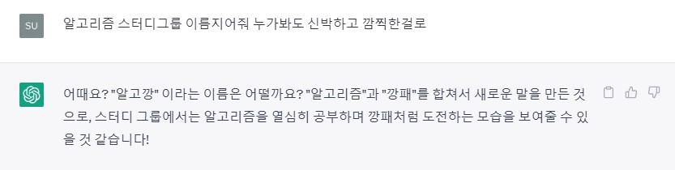

# AlgoGGang

# 📝 Rules
- 매주 월요일 오전 9시 59분까지 3문제 풀이하여 업로드하기! 
- 안 풀어오면 커피 사기☕ 
- 매주 월요일 오후 6시 코드 리뷰 진행합니다~ 
 

## 📍 Progress Record
|  | 문제 | 길민지 | 이우엽 | 윤상우 | 신선영 | 서지수 |
| :---: | :---: | :---: | :---: | :---: | :---: | :---: |
| GitHub | | [rninji](https://github.com/rninji) | [leewooyup](https://github.com/leewooyup) | [Awarduuu](https://github.com/Awarduuu) | [drsuneamer](https://github.com/drsuneamer) | [seojisoosoo](https://github.com/seojisoosoo)
| Language | |  |  |  |  |  |
| Week 01 (23.04.24.) |[B15686](https://www.acmicpc.net/problem/15686) | ❌ | ❌ | ❌ | ❌ | ❌
|  |[B2559](https://www.acmicpc.net/problem/2559) | ❌ | ❌ | ❌ | ❌ | ❌
| Week 02 (22.05.01.) | | ❌ | ❌ | ❌ | ❌ | ❌

| 해결 여부 | 표기 |
| :---: | :---: |
| 성공 | ✅ |
| 미해결 | ❔ |
| 시도 X | ❌  (사유) |

 

## 📋 Commit
> BaekJoon : BOJ  
Programmers : PRO  
SW Expert Academy : SWEA  
다른 문제 사이트는 ETC로 표기
> 
- GitHub commit 양식 : [Platform | Language] 문제 번호
- File 양식 : 이름 / week_N / B00000_문제제목 

## 📍 Commit Message Convention
- ➕ [ADD] : 문제 풀이 파일이나 부수적인 코드 추가
- ✅ [MOD] : 코드 및 내부 파일 수정
- 🗑 [DEL] : 쓸모없는 코드나 파일 삭제
- ✏️ [CORRECT] : 문법 오류 해결, 타입 변경, 이름 변경 등의 작은 수정
- 📄 [DOCS] : README 등의 문서 개정
- 🚚 [MOVE] : 프로젝트 파일 및 코드 이동
- 🔁 [RENAME] : 파일 이름 변경
- 🔀 [MERGE] : 다른 브랜치와의 충돌 해결 후 Merge
- ♻️ [REFACTOR] : 전면 수정
  

## 📍 Reference Site
&nbsp;&nbsp;&nbsp;&nbsp;&nbsp; 
